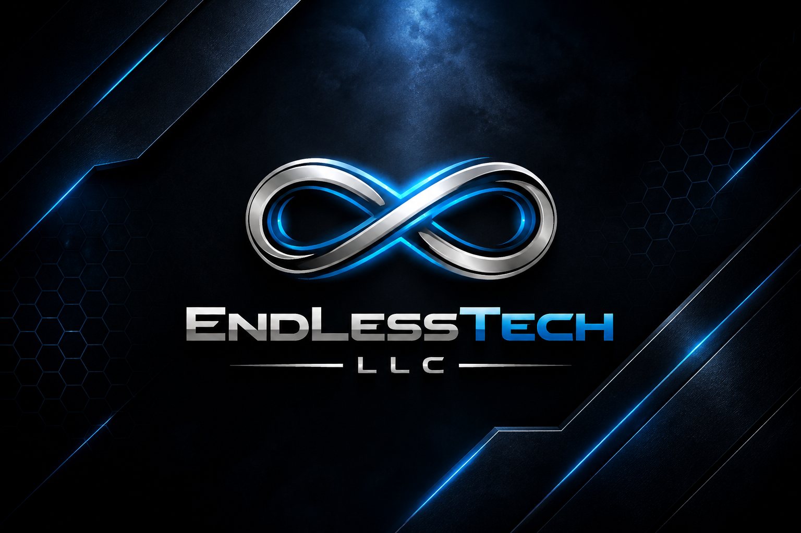

# EndLessTech LLC | Autonomous SaaS Holding



## Strategic Vision
EndLessTech LLC is a premier software holding company dedicated to architecting high-fidelity, autonomous SaaS ecosystems designed for strategic acquisition. Our mission is to engineer digital assets that maintain absolute technical transparency, operational autonomy, and institutional-grade security.

## Infrastructure Architecture (God Tier)
The platform is built on a "Secure-by-Default" foundation, utilizing a containerized multi-service architecture optimized for institutional due diligence and modular scalability.

### The Stack
- **Portal Node**: Next.js 16 (Turbopack) - Optimized via **Standalone Output** for 80% smaller image footprint.
- **Log Manager**: FastAPI (Python 3.11) - Direct Docker socket integration for real-time observability.
- **Identity**: Clerk v7 - Hardened JWT-based institutional security gating.
- **Observability**: New Relic Institutional Telemetry (Full-Stack: Browser + Server-Side Agent).
- **Hardening**: Docker Resource Limits (CPU/RAM Caps) & Automated Health Monitoring.

## Security & Observability
All sensitive sectors—including the Command Center, Telemetry Uplink, and Acquisition Pipeline—are protected by high-level system clearance gates.

- **Authoritative Telemetry**: Real-time system performance monitoring via integrated Metrics APIs and New Relic.
- **Automated Healthchecks**: Self-healing infrastructure that monitors and recovers nodes automatically.
- **Zero-Trust**: Identity management via Clerk with custom security components.
- **Encryption**: RSA-4096 and AES-256 standards enforced across all data layers.

## M&A Readiness (Technical Due Diligence)
Every asset within the EndLessTech portfolio is engineered for technical due diligence from Day 0.

- **Containerized Assets**: Fully dockerized infrastructure for immediate buyer hand-off and cloud-agnostic deployment.
- **Clean IP Architecture**: Modular codebases with zero legacy debt, following the "Clean Room" engineering protocol.
- **Operational Autonomy**: Systems designed to run with minimal human overhead via autonomous agents.

## Deployment Protocols

### 1. Environment Configuration
Create a `.env` file in the root (copied from `.env.local`) to provide institutional keys to the Docker build process:
```bash
NEXT_PUBLIC_CLERK_PUBLISHABLE_KEY=pk_...
CLERK_SECRET_KEY=sk_...
NEW_RELIC_LICENSE_KEY=...
NEXT_PUBLIC_NEW_RELIC_LICENSE_KEY=...
```

### 2. Operational Commands

#### Institutional Synthesis (Recommended)
This command builds the optimized standalone images, applies resource constraints, and initiates the health-monitored cluster.
```bash
docker compose up -d --build
```

#### Diagnostic Monitoring
```bash
docker compose ps       # Check node health and uptime
docker compose logs -f  # Stream real-time diagnostic output
```

#### Local Node (Isolated)
```bash
npm install
npm run dev
```

---
**Institutional Integrity | Technical Excellence | Autonomous Future**  
© 2026 EndLessTech LLC. All rights reserved.
